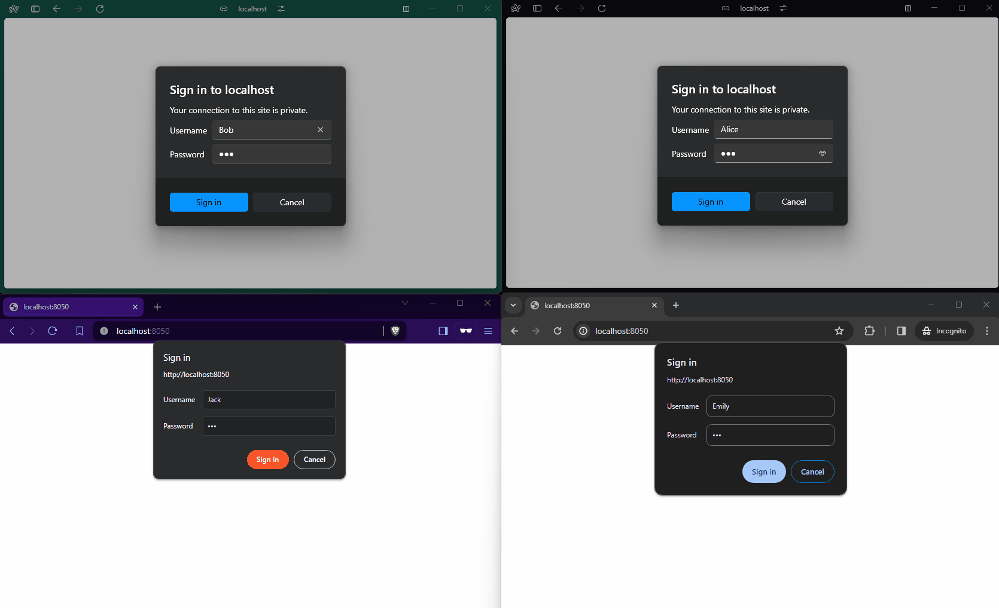

# dash-firestore-chat
A live chat example app to demonstrate dash-socketio capabilities




## Features

* Create/join chat rooms
* Live chat with other connected users
* Get notified when other users join/leave the chat
* Count of connected users

This uses firestore for both the database layer as well as
a message queue to notify the Dash server instance of live changes.


## Run locally:

In a terminal, start the Firestore emulator:

```bash
gcloud emulators firestore start --host-port=localhost:8080 --project=demo
```

In another terminal, run the Dash app:

```bash
python firestore_chat/app.py
```
